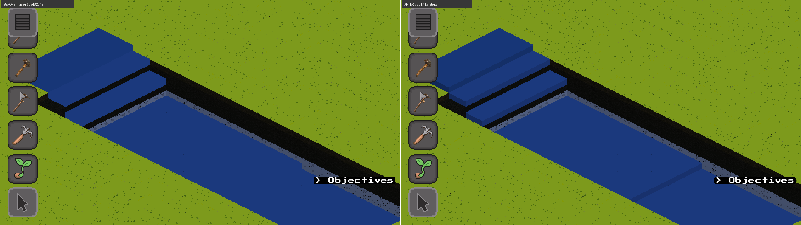
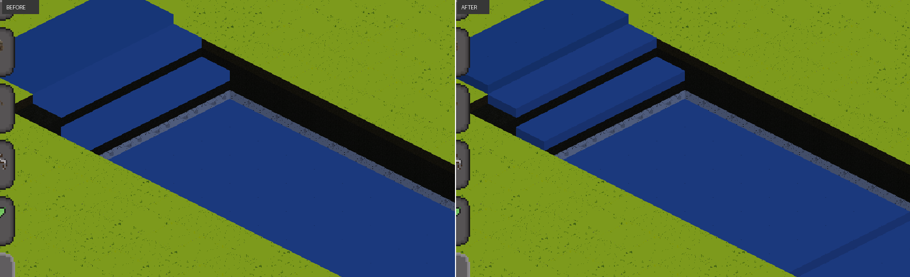

# #2517 — flat whole-z fluid steps: owner signoff

Requirement 7 of #2517 (epic #2514, DFL-1) gates merge on the owner accepting
the flat-step presentation from a before/after scene. This records that
verdict and how it was reached.

## Verdict

**ACCEPTED — coghex, 2026-09-10.**

## What was reviewed

A live graphical session, not only the captures: the scene was scripted into a
real window with `tools/flat_fluid_scene.py --window` and inspected
interactively with the simulation paused.

-  — full frames,
  master `65ad82319` left, this branch right.
-  — cropped to the steps.

The scene: a lake plateau at fluid z=1, a one-z step to z=0, a two-z step to
z=-2, a three-z step to z=-5, then a further one-z step at z=-6 that lands on
a chunk boundary. `tools/flat_fluid_scene.py` reproduces it and prints the
built profile's terrain and fluid z per column.

## What the owner confirmed

1. River and Lake tops read as **flat** slabs at their own whole z, with no
   ramping toward a lower neighbour.
2. The **one-z drops carry a vertical water edge** — in-chunk and at the chunk
   seam. This is the behaviour DFL-1 adds; before it, a one-z drop drew
   nothing, because the ramp was supposed to cover it.

## Question raised and resolved during signoff

The owner asked whether multi-z drops were missing their lower faces: a two-
or three-z drop shows only **one** level of water-coloured side, with darker
material below.

That is correct, and unchanged by this PR:

- The water side face covers the exposed **water** column only. The scene's
  water is one tile deep (`world.setFluidTile` places a single tile), so
  exactly one level of water side is exposed at any drop depth; everything
  below the waterline is terrain, drawn by the terrain renderer. Sampling the
  darker band confirmed it is a textured rock cliff (6-7 distinct colours),
  not an unfilled gap.
- This PR moves only the *threshold* that decides whether a drop draws at all
  (`nTerrZ < mySurf - 1` → `nTerrZ ≤ mySurf - minDrop`). `bottomZ` is
  untouched, so a two-z or five-z drop starts at the same z and emits the same
  quads it did on master. The only newly-admitted case is `nTerrZ == mySurf - 1`,
  the one-z drop.
- The multi-level case the arena scene cannot stage — a water column several z
  deep exposing several levels of water side — is covered by the pure specs
  instead: `World.Render.SideFace` asserts N quads for a drop of N z, for
  N = 1..5, wet and dry.

## Reproduce

```bash
# capture one side
python3 tools/flat_fluid_scene.py --engine "$(cabal list-bin exe:synarchy)" \
    --port 9481 --zoom 0.25 --out /tmp/flat_fluid.png

# or inspect it live in a real window (opens a focus-stealing window)
python3 tools/flat_fluid_scene.py --engine "$(cabal list-bin exe:synarchy)" \
    --window --port 9481
```

The two sides cannot be byte-compared — the arena re-randomises per-tile
ground scatter on every chunk re-mesh. Measured at 1280x720: same-build
control 1372 px (0.15%), master vs branch 22222 px (2.41%) and 20850 px
(2.26%) with the difference bounded to the scene region.
