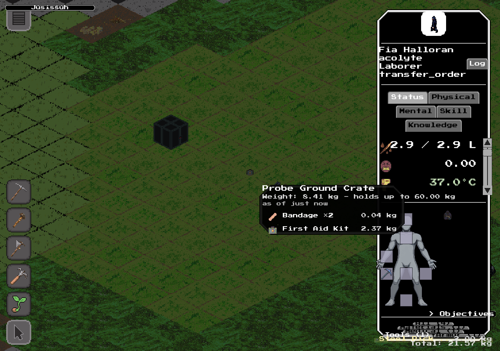

# #2527 — the portable container level: offscreen visual evidence

#2527's acceptance gates completion on running
`tools/item_list_widget_probe.py`'s portable scenario in its GPU-capable
manual environment and retaining the offscreen screenshot. Headless success
proves nothing about rendered pixels, so this is the frame itself rather than
a transcription of it.

## The capture



Taken by `item_list_widget_probe_portable.portable_scenario`, which writes it
to its `--shot` path with the level open and populated:

```
SYNARCHY_PROBE_ENGINE_EXE=<exe:synarchy> \
  python3 tools/item_list_widget_probe.py --port 9428 \
    --shot docs/pr-proofs/issue-2527-portable-container-level.png
```

Offscreen (GPU on, window off) on the one graphics-capable machine; the
probe is `manual-only`/`needs-gpu` and no CI runner can take it.

## What the frame shows

The window is the `portableItem` BASE level, opened from the ground crate's
own right-click `Contents` entry with no unit selected — there is no unit
info panel driving it and no building anywhere near it. Reading down:

- **`Probe Ground Crate`** — the level titles itself from the ground row's
  authored `displayName`, which #2527 adds to `item.listGround`.
- **`Weight: 8.41 kg - holds up to 60.00 kg`** — the crate's remembered
  WHOLE mass and its LIVE internal capacity, as two separate facts. They are
  deliberately not written as a ratio: `storedWeight` measures the whole
  crate (its own case, its fill and everything nested) while `storage:`
  bounds only what fits inside, so `8.41 / 60.00` would read as used storage
  and be wrong.
- **`as of just now`** — the shared `ageText` line, derived here from the
  CONTENTS observation's `revealedAt`.
- **`Bandage ×2  0.04 kg`** and **`First Aid Kit  2.37 kg`** — the remembered
  contents as GROUPED rows, so two bandages are one row of two rather than
  two rows. Each carries its icon and its per-row total mass, exactly as a
  building-side remembered level draws them: one renderer, two sources.

The `First Aid Kit` row is itself a container, and right-clicking it pushes
the nested level (asserted in the same scenario: it keeps the ROOT crate's
instance id and merely extends the path, and offers `Contents` and no
transfer gesture).

The other three knowledge states are asserted by the same scenario rather
than captured separately — never-inspected renders `Weight: unknown` with
`Contents unknown (never inspected)`, weight-only renders the mass with
`Contents unknown (never opened)` and an age taken from `weighedAt`, and
known-empty renders `(empty)` with an age.

## The run

All 17 portable checks PASS. The only failing check in that run is
`cargo_scenario`'s #1249 "firing Retrieve queues exactly one durable transfer
order at a distance" — the first scenario in the file, which runs entirely
before any #2527 code path, and which passed on an earlier run of this same
branch. It is the known flake in this probe.
