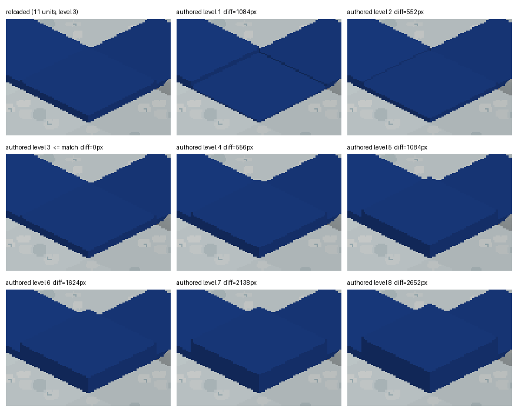

# #2535 — a reloaded partial fluid cell renders with its own level mask

This is the manual GPU evidence for requirement 5 of #2535.
`tools/fluid_exact_restart_render_probe.py` builds the headless
`fluid_exact_restart` scenario and saves it. It then loads that save in a fresh
`--offscreen` engine and grades the reloaded cell by its pixels. The query
values below are not used as the pixel proof.

## The capture



Each panel is the same crop of the cell's screen box, shown at 2x with 12 px of
padding. The screen box is every pixel where the eight authored levels
disagree. The top-left panel is the reloaded frame. The other panels show the
same cell at the same whole z. Each was authored with
`debug.setFluidSurface(page, 0, 0, 'lake', 8 + L)` for levels L = 1..8. `diff`
counts the changed pixels in the box between each panel and the reloaded frame.

## Run

On the owner's macOS/aarch64 laptop, using the branch's own build:

```
python3 tools/fluid_exact_restart_render_probe.py --port 9286 --out <dir>
```

All checks passed (`failedChecks: 0`). The probe's `manifest.json`
contained these values:

| Field | Value |
|---|---|
| page / tile | `fluid_exact_restart_page` / (0, 0) |
| type | lake |
| terrain top | z 1 |
| `surfaceUnits` (exact) | 11 |
| `fluidLevel` | 3 |
| `fluidSurf` (ceiling) | 2 |
| render height | 1.375 z |
| matched mask level | **3** |
| cell box (x, y, w, h) | 454, 403, 116, 75 |
| noise floor (reloaded vs. immediate re-capture) | 0 px |
| per-level difference, levels 1..8 | 1084, 552, **0**, 556, 1084, 1624, 2138, 2652 |
| after re-authoring the reloaded value | identical per-level differences |

The reloaded frame matches authored level 3 exactly, with 0 changed pixels. It
differs from every other level, and the difference grows with distance from
level 3. Re-authoring the reloaded exact value renders the same mask again.

The edited cell's partial level came from the simulation, not from authoring.
`world.setFluidTile` placed a full level-8 cell, and the flow reduced it to
11 units at level 3. The session was then paused, settled, saved, and closed.
A fresh process loaded the save and was compared while paused.
