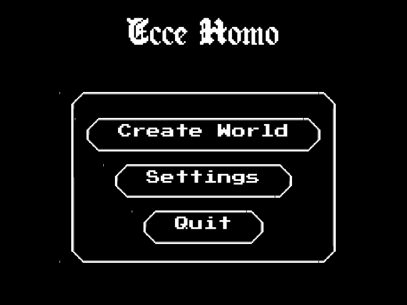

# #2656 — the main-menu title at the formal 800x600 minimum

Before #2656, the main menu at 800x600 and UI scale 1.0 showed only the
bottom slivers of the `Ecce Homo` title along the top edge. The title's
baseline sat at y=4, and its 96 px glyphs rose above the frame. This frame
shows the fixed layout with the whole title visible above the panel.

## The capture



Taken offscreen (GPU on, window off) from this branch's own build, with
its own resource root:

```
$(cabal list-bin exe:synarchy) --offscreen --port 9056 --size 800x600
# wait for READY, then poll until
#   package.loaded['scripts.main_menu'].uiCreated and .titleLabelId
echo "return debug.captureScreenshot('<worktree>/docs/pr-proofs/issue-2656-main-menu-800x600.png')" \
  | nc -w 10 localhost 9056
echo 'engine.quit()' | nc -w 2 localhost 9056
```

- **UI scale:** `engine.getUIScale()` returned `1.0`.
- **Save count:** `#engine.listSaves()` returned `0`, so the menu shows three
  actions: Create World, Settings, and Quit.

## Geometry read from the same process

Queried over the console just before the capture:

```
fb=800x600 title x=249.5 y=88.0 w=301.0 fs=84 glyphTop=4.0
panel x=117.5 y=158.0 w=565.0 h=382.0
```

The compact fallback now reserves `titleOffset + titleFontSize` of headroom,
which shrinks this menu's effective scale to about 0.88. The configured scale
stays at 1.0. The title's effective font size is 84 px, so its glyph top is
at y=4. Its baseline is at y=88, 70 px above the panel's top edge at y=158.
Both the title and the panel are horizontally centred:
249.5 + 301/2 = 400 and 117.5 + 565/2 = 400.
