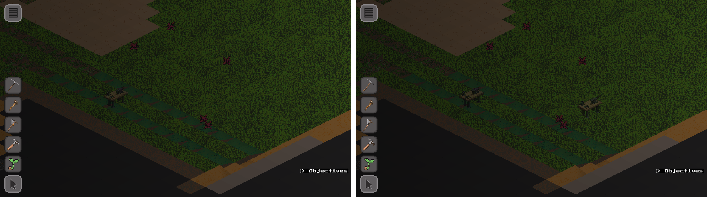
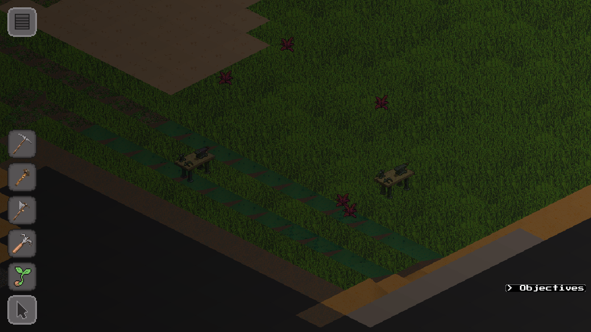

# #2691 — placed buildings drawn and hit-tested through the seam alias

Visual evidence for #2691: a building staked on the far side of the
cylindrical seam draws, and is clickable, beside the terrain it stands on.

## The captures

-  — master
  `e3c781c77` on the left, this branch on the right. Same scene, same camera.
-  — the branch frame on its own.

Both frames are `--offscreen` captures at 1280x720 with zoom 0.25, taken with
the simulation paused.

## The scene

The scene uses a generated world 16 chunks across, which is 256 tiles, so the
seam falls at `u = gx - gy = ±128`. The camera is centred on tile `(63, -63)`,
at `u = 126`, just inside the seam. Two workbenches are spawned with
`building.spawn`, the call the construction stake makes:

| id | canonical anchor | `u` | where it should draw |
|---|---|---|---|
| 2 (control) | `(61, -61)` | 122 | 4 tiles west of the camera, on the canonical alias |
| 1 (across the seam) | `(-63, 63)` | -126 | 4 tiles east of the camera, on the alias `u = 130` |

Both anchors are on dry land, and both chunks are loaded and drawn. The
camera's z-slice is pinned to the highest of the three surface levels, so the
camera band culls neither building.

## What the frames show

- **Master:** only the control is drawn. The workbench across the seam was
  placed at its canonical anchor, a whole world-width away, so it is
  offscreen, while the terrain it stands on is drawn right of centre.
- **Branch:** both workbenches are drawn, symmetric about the camera. The
  building across the seam stands on its own ground at `u = 130`.

A numeric oracle confirms the same thing through the hit test. The frame was
swept every 6 px with `building.hitTestAt(px, py)`:

| build | building 2 (control) | building 1 (across the seam) |
|---|---|---|
| master | x 372–474, y 306–414 | **never hit** |
| branch | x 372–474, y 306–414 | x 804–906, y 342–450 |

On the branch, each building is hit exactly where it is drawn. On master, the
building across the seam cannot be clicked anywhere on screen. The control is
hit at the same pixels in both builds.

## Reproduce

Boot the engine offscreen with `--size 1280x720`, wait for
`building.listDefs()` to fill, then send these debug-console calls in order:

```lua
package.loaded['scripts.ui_manager'].onOpenArena()
world.waitForInit(120)
package.loaded['scripts.world_manager'].createWorld({worldId='seam16', seed=42, worldSize=16, plateCount=3, structural=package.loaded['scripts.world_view'].structuralTextures})
world.waitForInit(600)
world.show('seam16'); world.hide('test_arena')
engine.setPaused(true); world.setTimeScale(0); world.setSunAngle(0.5)
world.loadChunksInRegion(1, -8, 8, 0, 'seam16'); world.loadChunksInRegion(-8, 0, -1, 8, 'seam16'); world.waitForChunks(120, 'seam16')
building.spawn('workbench', -63, 63, 'seam16')   -- id 1, across the seam
building.spawn('workbench', 61, -61, 'seam16')   -- id 2, control
-- unpause for ~1.5 s so the spawns commit, then pause again
camera.setZoom(0.25)
-- pin the camera on (63, -63) at z 41 (tools/probelib.pin_camera_to_tile)
debug.captureScreenshot('<out>.png')
```

Screenshots from two different builds cannot be byte-compared. Arena scatter
is randomised again on every re-mesh. The evidence is the missing or present
building, and the hit-test table above, which does not depend on pixels.
